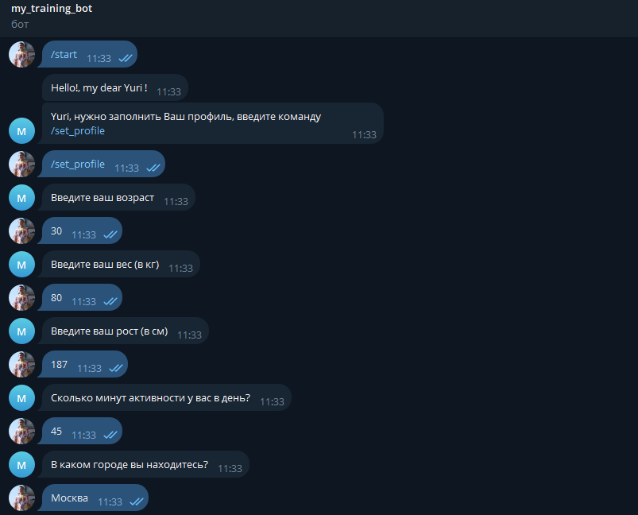
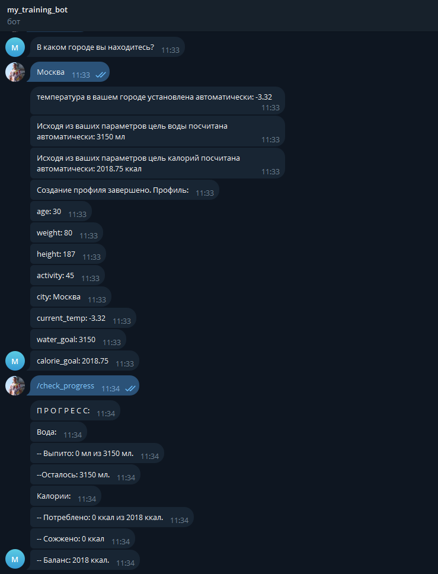
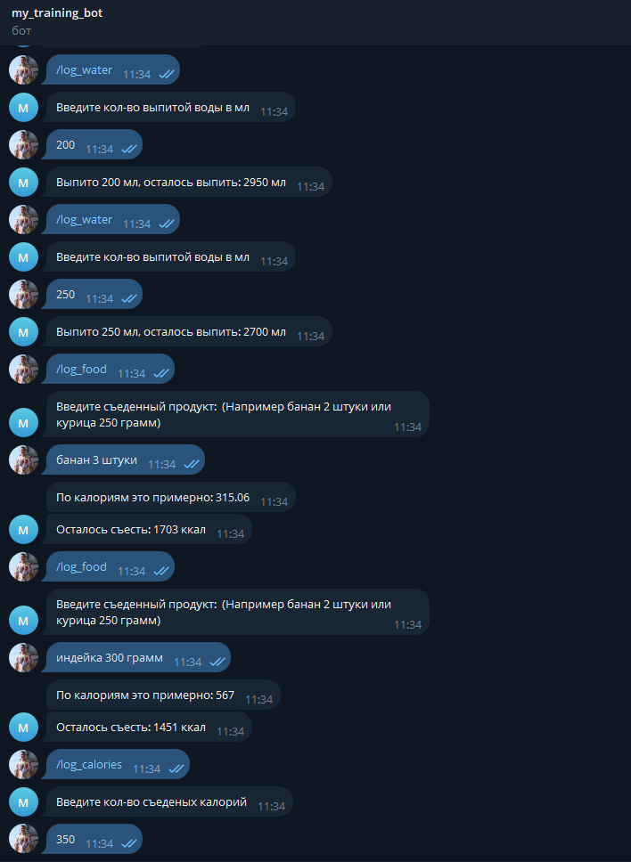
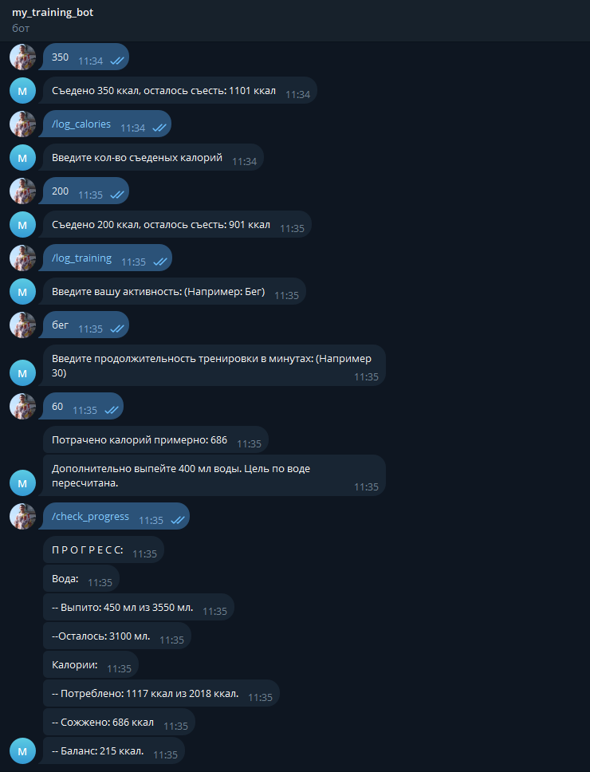

Тестовый телеграм бот для подсчёта и учёта калорий.

В боте используются:
 * api для получения температуры в городе: OpenWeatherMap
 * api для получения калорий по продуктам и тренировкам: nutritionix,
 * для перевода на английский: библиотека googletrans 

Рабочие команды:
 - /start - приветствие! Давайте начнем
 - /set_profile - заполнение профиля
 - /log_water - сохраняет, сколько выпито воды
 - /log_food - сохраняет, сколько съедено калорий (автоматический подсчёт по съеденным продуктам)
 - /log_calories - сохраняет, сколько съедено калорий
 - /log_training - фиксирует сожжённые калории
 - /check_progress - вывод прогресса

Скриншоты работы:

